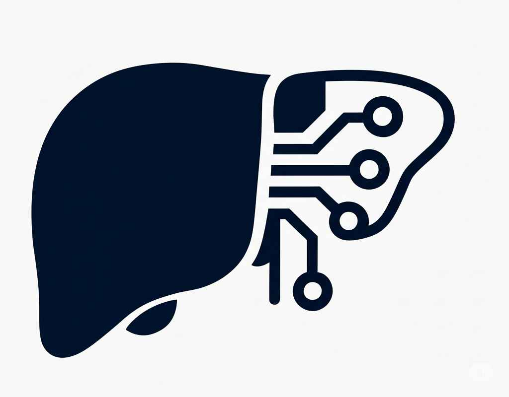

Türkçe için: [README_tr.md](README_tr.md)

<p align="center">
  <a href="https://github.com/sumeyyeagir/Main2">
 
   </a>
    <h2 align="center">FibroCheck</h2>
    <p align="center">
    AI Model-Supported Liver Fibrosis Staging Application
     <br/>
    <a href="https://github.com/sumeyyeagir/Main2"><strong>Explore the Docs »</strong></a>
    <br/>
     <a href="https://github.com/sumeyyeagir/Main2/issues">Report Bug</a>
    .
    <a href="https://github.com/sumeyyeagir/Main2/issues">Request Feature</a>

## Table of Contents    
* [About the Project](#about-the-project)
* [Technologies Used](#technologies-used)
* [Datasets Used](#datasets-used)
* [Getting Started](#getting-started)
* [Screenshots](#screenshots)
* [Roadmap](#roadmap)
* [Contributing](#contributing)
* [Developers](#developers)

---

## About the Project


This application, developed with an AI model, is built with React and supported by state-of-the-art technologies. It was created by an internship team consisting of computer and software engineers under the guidance of Halis Altun (Head of Software Engineering Department at İSTÜN) and Nazlı Tokatlı (Head of Computer Engineering Department at İSTÜN).

With this project at İSTÜN, we aimed to:
* Provide AI-supported early diagnosis for liver fibrosis staging and cirrhosis detection, considering the challenges of the biopsy process.
   
## Technologies Used

FibroCheck is an AI-powered application for staging liver fibrosis. The project combines modern web technologies and machine learning infrastructure:

* **React.js** – For a modern and dynamic user interface.  
* **Python** – For developing and integrating machine learning models.  
* **SQLite (users.db)** – For securely storing user data.  
* **JSON** – For data transfer and configuration.  
* **scikit-learn** – For training liver fibrosis staging models.  
* **TensorFlow / Keras (.h5 model)** – For deep learning-based model training and predictions.  
* **Pickle (.pkl files)** – For saving and reusing trained models.  

---

## Datasets Used

We used 2 datasets in our application:  

1. **Kaggle: Histopathology Fibrosis Ultrasound Dataset** – 6,323 grayscale B-mode ultrasound images containing F0-F4 fibrosis stages.  
2. **Kaggle: Liver Disease Patient Dataset** – Contains 30,691 records of blood values (AST, ALT, albumin, etc.).  

Before using these datasets, preprocessing was applied:  
* Missing values were filled with mean values.  
* Gender information was encoded using **LabelEncoder**.  
* Numerical data was normalized using **StandardScaler**.  
* Images were resized to 128x128 and normalized.  
* Training/testing split was applied (80%-20%).  

After preprocessing, model training was initiated.  

---

## Getting Started  

This section provides the steps to run the FibroCheck application on your local machine.  

### Requirements  

You need to have the following installed:  
- **Visual Studio / Visual Studio Code**  
  [Download](https://visualstudio.microsoft.com/downloads/)  
- **Python 3.9+**  
  [Download](https://www.python.org/downloads/)  
- **Node.js and npm (16+)**  
  [Download](https://nodejs.org/en/download/)  
- **SQLite**  
  [Download](https://www.sqlite.org/download.html)  

### Installation  
1. Clone the project:  
   ```bash
   git clone https://github.com/sumeyyeagir/Main2.git
2. Install backend dependencies:
    ```bash
    pip install -r requirements.txt
3. Install frontend dependencies:
    ```bash
    npm install
### Running the Application
1. To start the backend:
    ```bash
     python app.py
2. To start the frontend:
    ```bash 
    npm start


## ScreenShots


## Roadmap
Check open issues for a list of proposed features and known issues.
Click Here to View

## Contributing

Contributions make the open-source community a great place to learn, inspire, and create. We are grateful for any contributions.

* If you have suggestions for adding or removing features, feel free to open an issue or directly create a pull request after updating the README.md file accordingly. Click Here to View or Open Issues
* Please check your spelling and grammar.
* Submit a separate PR for each suggestion.
* Please review the Code of Conduct before publishing your first idea.

## How to Create a Pull Request
To contribute to the FibroCheck project, follow these steps:

1. Fork the project to your own GitHub account.(Click the Fork button at the top right.)
2. Create a new feature branch:
    ```bash
    git checkout -b feature/YeniOzellik
3. Make your changes and commit them:
    ```bash
    git add .
    git commit -m "Added new feature"
4. Push the branch to GitHub:
   ```bash
   git push origin feature/YeniOzellik
5. Open a Pull Request for the feature/NewFeature branch.

## Developers
* İSTÜN Internship Team

## Acknowledgments
* Thanks to all my teammates and mentor for their support during the development of this project.
