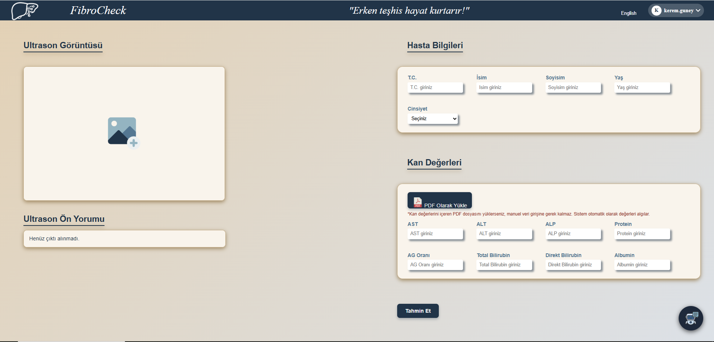
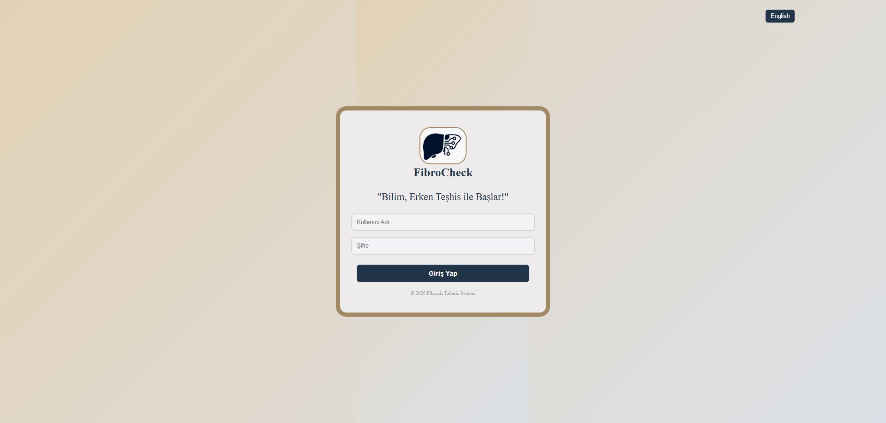
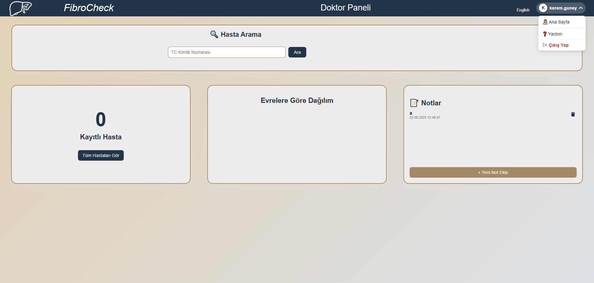
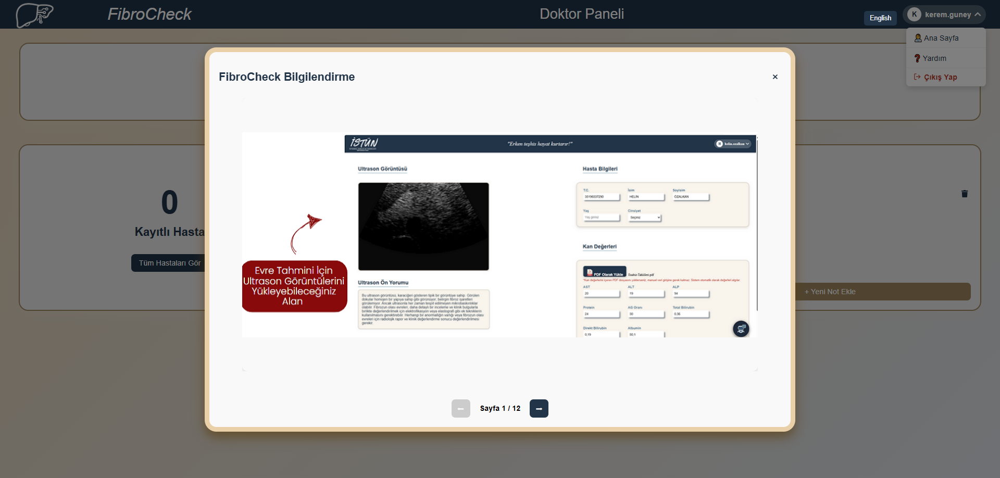

English version: [README_en.md](README_en.md)
<p align="center">
  <a href="https://github.com/sumeyyeagir/Main2">
 
   </a>
    <h2 align="center">FibroCheck</h2>
    <p align="center">
    Yapay Zeka Model Destekli Karaciğer Fibrozis Evreleme Sistemi
     <br/>
    <a href="https://github.com/sumeyyeagir/Main2"><strong>Belgeleri Keşfedin »</strong></a>
    <br/>
     <a href="https://github.com/sumeyyeagir/Main2/issues">Hata Bildir</a>
    .
    <a href="https://github.com/sumeyyeagir/Main2/issues">Özellik İsteği</a>

## İçindekiler    
* [Proje Hakkında](#proje-hakkında)
* [Kullanılan Teknolojiler](#kullanılan-teknolojiler)
* [Kullanılan Veri Setleri](#kullanılan-veri-setleri)
* [Web Arayüzü](#web-arayüzü)
* [Başlatma](#başlatma)
* [Ekran Görüntüleri](#ekran-görüntüleri)
* [Yol Haritası](#yol-haritası)
* [Katkıda Bulunmak](#katkıda-bulunmak)
* [Geliştiriciler](#geliştiriciler)


## Proje Hakkında



FibroCheck, karaciğer fibrozisinin evrelerini (**F0-F4**) non-invaziv yöntemlerle tahmin etmeyi amaçlayan iki modüllü yapay zeka tabanlı bir karar destek sistemidir.

Yapay zeka modeli ile geliştirilen bu uygulamamız react ve model destekli geliştirilen ve son teknolojileri kullanan bir uygulamadır. Bu uygulama İSTÜN Yazılım Mühendisliği Bölüm Başkanı Halis Altun ve Bilgisayar Mühendisliği Bölüm Başkanı Nazlı Tokatlı rehberliğinde bilgisayar ve yazılım mühendislerinden oluşan staj ekibi tarafından geliştirilmiştir.

FibroCheck iki aşamalı modüler yapıya sahiptir:**Kan Tahlili Analizi (Structured Data)**, **Ultrason Görüntü Analizi (Imaging Data)**. Her iki modelin çıktıları birleştirilir. **LLM destekli doğal dil yorumlayıcı** aracılığıyla detaylı medikal rapor oluşturulur. Rapor hem Türkçe hem İngilizce dil seçeneklerine sahiptir.

**Anahtar Kelimeler**
`Fibrozis` • `Karaciğer Hastalığı` • `Yapay Zeka` • `CNN` • `ResNet-50` • `Random Forest` • `Ultrason` • `Kan Tahlili` • `Evre Tahmini` • `Biyopsi Alternatifi`

**Neden Önemli?**
Karaciğer biyopsisi, fibrozisin evrelendirilmesinde altın standart olsa da **invaziv, ağrılı ve riskli** bir yöntemdir. FibroCheck, biyopsi ihtiyacını azaltacak, yüksek doğrulukla çalışan bir **alternatif tanı sistemi** sunmaktadır.
   
 ## Kullanılan Teknolojiler

FibroCheck, karaciğer fibrozisini evreleyen yapay zekâ destekli bir uygulamadır.Projede modern web teknolojileri ve makine öğrenimi altyapısı birlikte kullanılmıştır:

* React.js – Kullanıcı arayüzünün geliştirilmesinde modern ve dinamik bir deneyim için.
* Python – Makine öğrenimi modellerinin geliştirilmesi ve entegrasyonu için.
* SQLite (users.db) – Kullanıcı verilerinin güvenli bir şekilde saklanması için.
* JSON – Veri transferi ve yapılandırma için.
* scikit-learn – Karaciğer fibrozisi evreleme modellerinin eğitilmesi için.
* TensorFlow / Keras (.h5 modeli) – Derin öğrenme tabanlı model eğitimi ve tahminleri için.
* Pickle (.pkl dosyaları) – Eğitilmiş modellerin saklanması ve yeniden kullanımı için.

## Kullanılan Veri Setleri

Uygulamamızda 2 adet veri seti kullandık. Bu veri setlerinden birincisi (Kaggle: Histopathology Fibrosis Ultrasound Dataset) 6323 adet F0-F4 görselleri içeren gri tonlamalı B-mod ultrason görüntüleridir.

Diğer veri setimiz(Kaggle: Liver Disease Patient Dataset) ise içinde 30.691 adet kayıt bulunan kan değerlerini (ast,alt,albumin...) içeren veri setidir.

Bu verileri kullanmadan önce ön işleme gerçekleştirdik.Bu ön işleme ile:
* Eksik veriler ortalama değerlerle tamamlanmıştır. 
*	Cinsiyet bilgileri sayısallaştırılmıştır (LabelEncoder). 
* Sayısal veriler StandardScaler ile normalleştirilmiştir. (Normalizasyon)
* Görseller 128x128 boyutuna çekilip, normalizasyon işlemine tabi tutulmuştur. 
* Eğitim/test ayrımı %80-%20 oranında gerçekleştirilmiştir. 

## Web Arayüzü

FibroCheck, kullanıcı dostu **web tabanlı bir arayüze** sahiptir:

* **Ultrason görüntüsü yükleme alanı**
* **Kan tahlili giriş alanları** (manuel veya otomatik doldurma)
* **Grafiksel & istatistiksel analizler**
* **Doktor için özelleşmiş kişisel Doktor Paneli**
* **Not ekleme ve kişiselleştirme**
* **Chatbot desteği**
* **Yardım alanı**

## Özellikler

* Non-invaziv tanı yöntemi → biyopsi ihtiyacını azaltır
* Kan ve görüntü verilerini birlikte analiz eder
* %96’ya varan yüksek doğruluk
* LLM destekli doğal dil raporlama (TR/EN)
* Klinik karar destek sistemlerine entegre edilebilir
* Hızlı, pratik ve kullanıcı dostu arayüz

 ## Başlatma
 Bu bölüm, FibroCheck uygulamasını yerel bilgisayarınızda çalıştırabilmeniz için gerekli adımları içerir.
### Gereksinimler
Bu projeyi çalıştırabilmek için aşağıdaki araçların kurulu olması gerekir:
- **Visual Studio / Visual Studio Code**
  [İndir](https://visualstudio.microsoft.com/downloads/)
- **Python 3.9+**  
  [İndir](https://www.python.org/downloads/)  
- **Node.js ve npm (16+)**  
  [İndir](https://nodejs.org/en/download/)  
- **SQLite** 
  [İndir](https://www.sqlite.org/download.html)  
### Kurulum
1. Projeyi klonlayın:
   ```bash
   git clone https://github.com/sumeyyeagir/Main2.git
2. Backend bağımlılıklarını yükleyin:
    ```bash
    pip install -r requirements.txt
3. Frontend bağımlılıklarını yükleyin:
    ```bash
    npm install
### Çalıştırma
1. Backend başlatmak için:
    ```bash
     python app.py
2. Frontend başlatmak için:
    ```bash 
    npm start


## Ekran Görüntüleri





## Yol Haritası
Önerilen özelliklerin ve bilinen sorunların listesi için açık konulara bakın.
[Görüntülemek İçin Buraya Tıklayın](https://github.com/sumeyyeagir/Main2/issues) 

## Katkıda Bulunmak
Katkılarınız, açık kaynak topluluğunu öğrenmek, ilham almak ve yaratmak için harika bir yer haline getiriyor. Yaptığınız her türlü katkı için minnettarız.

* Projelerin eklenmesi veya kaldırılması konusunda önerileriniz varsa, bunları tartışmak için bir konu açmaktan çekinmeyin veya README.md dosyasını gerekli değişikliklerle düzenledikten sonra doğrudan bir çekme isteği oluşturun. [Buraya Tıklayarak Sorun ve Önerileri Görüntüleyebilir ve Konu Açabilirsiniz](https://github.com/sumeyyeagir/Main2/issues) 
* Lütfen yazım ve dilbilginizi kontrol ettiğinizden emin olun.
* Her öneri için ayrı bir PR oluşturmanızı rica ediyorum.
* Lütfen ilk fikrinizi yayınlamadan önce davranış kurallarını okuyarak fikir yayınlamanızı rica ediyorum.

## Çekme(Pull) İsteği Nasıl Oluşturulur
FibroCheck projesine katkı sağlamak isteyenler aşağıdaki adımları takip ederek çekme isteği (Pull Request) oluşturabilir:

1. Projeyi kendi GitHub hesabınıza **fork** edin.  
(Sağ üstte bulunan **Fork** butonuna tıklayın.)
 
2.  Yeni Özellik Dalı Oluşturun
    ```bash
    git checkout -b feature/YeniOzellik
3. Geliştirmelerinizi yapın ve değişiklikleri commit edin:
    ```bash
    git add .
    git commit -m "Yeni özellik eklendi"
4. Dalı GitHub’a Gönderin (Push)
   ```bash
   git push origin feature/YeniOzellik
5. Pull Request Oluşturun
GitHub sayfasına gidin ve feature/YeniOzellik dalı için bir pull request açın

## Geliştiriciler
* **Helin ÖZALKAN**
* **Sümeyye AĞIR**
* **Kevser SEMİZ**
* **Büşra İNAN**
* **Devran ŞAHİN**
* **Ege KUZU**
* **Erva ERGÜL**
* **Cengizhan KARAMAN**
* **Kerem GÜNEY**
* **Enes Can ÇOBAN**

## Teşekkürler
